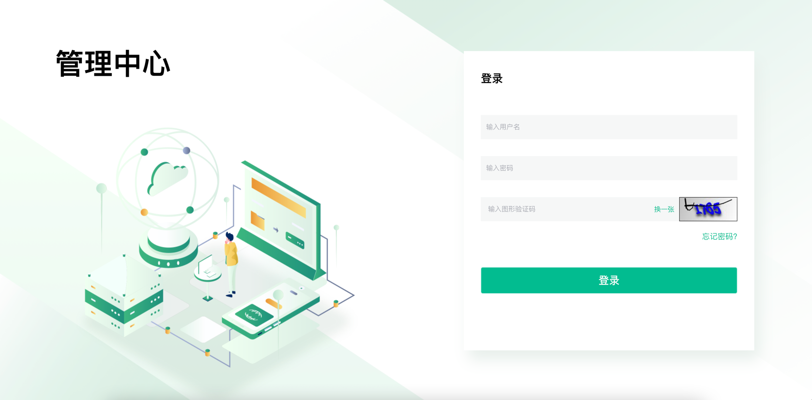
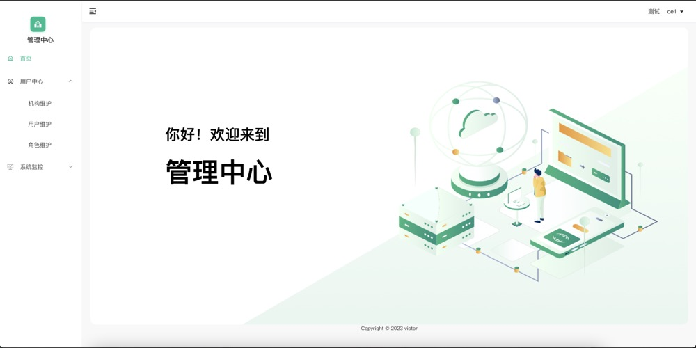

# 前言
当前工程是基于ruoyi项目的微服务版本改造成的单应用版本,支持SM2加密等功能的使用、
只是缺少gateway的网关配置前端将不在配置请求头去确认进入哪个服务、当前版本登录权限
与ruoyi不同使用SM3+加盐,可以支持多数据库配置、注意使用mybatis-plus-join,不然
需要在dao包中配置数据库的mapper文件配置

# 本项目内容
| 包名     | 作用域             |
|--------|-----------------|
| auth   | 登录所使用的接口        | 
| common | 所有的基础工具和dao层    | 
| job    | 所有的定时任务相关内容     | 
| server | 所有的业务服务内容(自己配置) | 
| system | 所有的关于权限体系等相关内容  | 

### common包中的内容
| 包名         | 作用域                                     |
|------------|-----------------------------------------|
| core       | 所有工具类常量池的配置信息包                          | 
| dao        | dao层设置了多数据库的Maven配置注意pom中的配置            | 
| datasource | 关于所有与sql调用的配置并基于sqlserver2012之后分页问题添加配置 | 
| entity     | 所有对象存储位置                                | 
| log        | 关于存储业务log日志配置                           | 
| redis      | 关于redisson的配置与幂等有关                      | 
| security   | 权限配置核心层核心文件WebMvcConfig与File            | 
| swagger    | 所有的关于swagger配置相关内容                      | 

# UI界面
### 登录界面

### 管理界面
